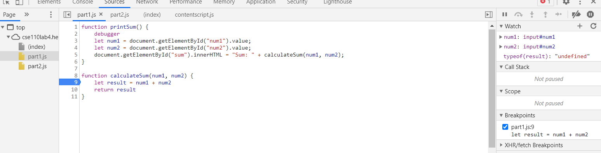
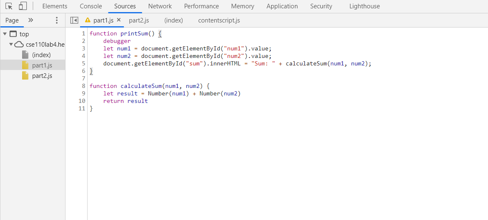

- The bug was that we were using num1 and num2 as strings, so "adding" them was really concatenating them.
   This was evidenced by result being a string.
- This could be fixed by converting both num1 and num2 into numbers before adding them.

1) The json is called citylots.json.
2) part2.js initiated the download of this file.
3) The file is 11.7 MB.
4) The file took 91 ms to download.
5) The user-agent was Mozilla/5.0 (Windows NT 10.0; Win64; x64) AppleWebKit/537.36 (KHTML, like Gecko) Chrome/88.0.4324.104 Safari/537.36.
6) It came from an Apache server.
7) The file was last modified Tuesday, 26 Jan 2021 at 22:14:13 GMT.
8) The content-type of the file is application/json.
9) fetchData() made the request.
